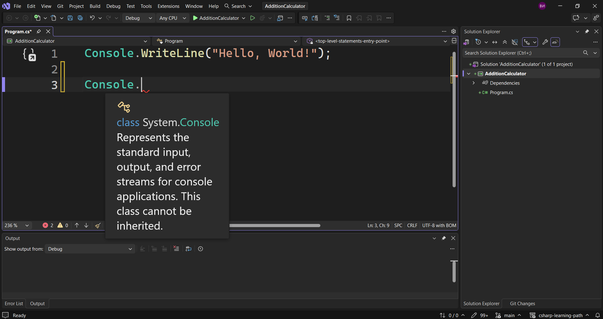
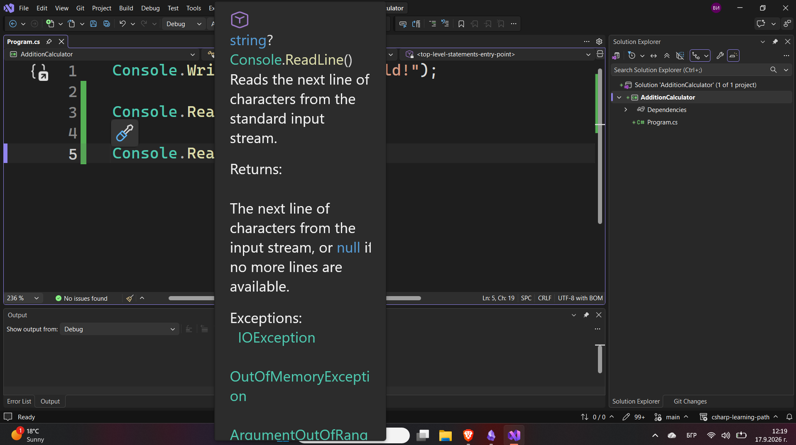
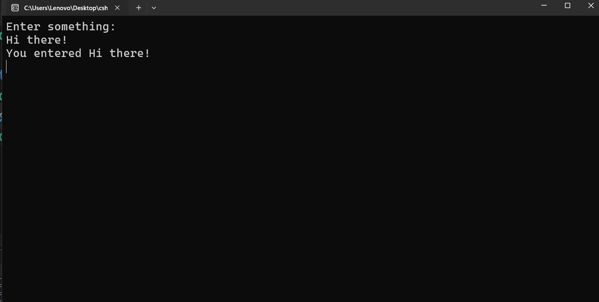

---
type: csharp-note
language: C#
created: 2026-09-17
tags:
  - csharp
---

# Разбиране на потребителски вход и тип данни стринг

## 📌 Какво ще се прави?

Ще разберем как да получаваме входни данни и как да ги съхраняваме в променлива.


## 🧠 Бележки

Ще се опитаме да си създадем калкулатор, който на този етап може предимно да добавя.
Първото нещо, което трябва да направим, е да получим входни данни от потребителя. Това ще направим тук.
След това трябва да разберем как се съхраняват данни, как се съхранява стойност. И последното нещо ще бъдат аритметичните операции, като например събиране в този случай.
Има и още едно допълнително нещо, което трябва да разгледаме и това е как да преобразуваме един тип данни в друг.
Създаваме нов проект, който ще наречем `AdditionCalculator`.
Нека да получим входни данни от потребителя. За целта ние ще използваме класа `Console`.



Можем да видим, че когато го посочим, той представлява стандартните потоци за вход, изход и грешка. Този клас не може да бъде наследен.
Важното обаче е, че това ни помага не само за изхода, но и за входа.
Това означава, че можем да го използваме, за да получим входни данни. За целта обаче трябва да добавим и метода `ReadLine()`.

> [!code] C# Получаване на потребителски вход
> ```csharp
> Console.ReadLine();
> ```

Какво представлява този `ReadLIne()`?
Както казахме, това е метод. Методът по същество е колекция от код или редове код, които се изпълняват, когато методът се извика.
По-късно ще видим как можем да създаваме собствени методи и да ги извикваме. Така ще имаме пълен контрол върху приложенията си.
Засега обаче ще използваме съществуващ, наречен `ReadLine()`.
Класовете могат да съдържат множество методи. Те могат да съдържат и други неща, но засега ще се спрем на методите.
Как да съхраним въведените от потребителя входни данни? Ще трябва да използваме променлива.



Виждаме, че тук пише `string? Console.ReadLine()`.
Стрингът тук ни показва, че този метод връща нещо. Този метод ни дава възможност да въведем нещо като потребител. Каквото и да въведем, то ще бъде съхранено, както ще направим в този случай, или нищо няма да се случи с него, ако решим да не го използваме.
За да го съхраним, ще използваме променлива.

> [!code] C# Съхраняване на входни данни в променлива
> ```csharp
> string userInput = Console.ReadLine();
> ```

И така, какво се случва тук?
Ние създадохме променливата `userInput`, която е от тип стринг. Типът данни стринг е този, който се използва за текст.
Сега този `ReadLine()` видяхме, че той връща стринг.
Сега обаче ние можем да отпечатаме това, което потребителят въведе като входни данни.

> [!code] C# Отпечатване на входните данни на конзолата
> ```csharp
> Console.WriteLine("You entered " + userInput);
> ```

Ние използваме `Console.WriteLine`, а вътре в скобите имаме кавички, след което имаме текста `You entered`, последвано от празно място, знака + и въведените от потребителя входни данни. Знакът + тук служи за добавяне на два низа заедно, като така създаваме по-голям стринг.
За да държим нашата конзола будна и да не я затваряме, ще използваме следното.

> [!code] C# Предотвратяване на автоматично затваряне на конзолата
> ```csharp
> Console.Readkey();
> ```

Това ще изчака да натиснем произволен клавиш, преди конзолата да се затвори.
Вместо да казваме `Hello, World!` в началото, нека да го променим на `Enter something:`.

> [!code] C# Промяна на първоначален текст
> ```csharp
> Console.WriteLine("Enter somеthing:");
> ```

Нека сега да стартираме тази програма.



Виждаме, че след като въведем `Hi there!`, на конзолата се появява текста `You entered Hi there!`.
По този начин работим с потребителския вход и научихме какво е типът данни стринг.

