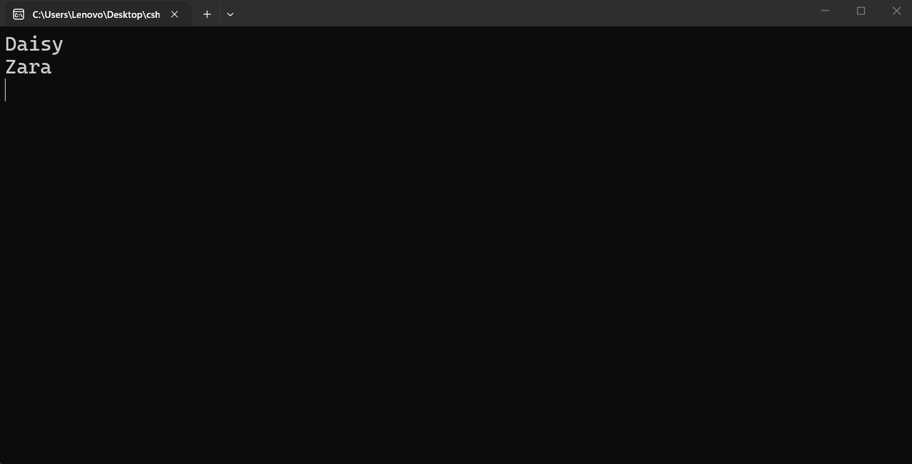

---
type: csharp-note
language: C#
created: 2026-09-17
tags:
  - csharp
---

# Дефиниране на променлива, инициализация и присвояване

## 📌 Какво ще се прави?

Ще научим как да дефинираме променлива, как да ѝ присвоим стойност, как да променим тази стойност и как да я достъпим.


## 🧠 Бележки

Ние видяхме как да направим и двете, имайки следния ред код.

> [!code] C# Деклариране и присвояване на стойност на променлива
> ```csharp
> string myName = "Vladislav";
> ```

Тук ние имаме и двете неща в едно. Ние дефинираме променливата и след това я инициализираме.
Какво означава това?
Нека да си направим още една променлива.

> [!code] C# Деклариране на променлива
> ```csharp
> string petsName;
> ```

Името на домашния любимец тук не е определено в началото. То ще се дефинира само след като потребителят въведе стойност. Затова това, което направихме тук, се нарича `деклариране на променлива`.
Ние можем да инициализираме тази променлива по-късно, т.е. можем да ѝ присвоим стойност по-късно. Например можем да кажем

> [!code] C# присвояване на стойност на променлива
> ```csharp
> petsName = "Daisy";
> ```

Тук ние `инициализираме/присвояваме стойност` на променлива.
Има и друго нещо, което можем да направим тук, а именно да презапишем стойността на променливата. Затова ние можем да направим следното.

> [!code] C# Презаписване на променлива
> ```csharp
> petsName = "Zara";
> ```

И така, тук ние `презаписваме` стойността на променливата.
Ако решим да видим това в конзолата



Виждаме, че първо имаме `Daisy`, а после имаме `Zara`.


