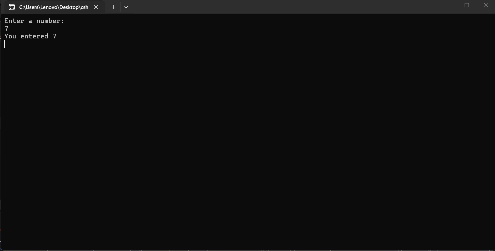
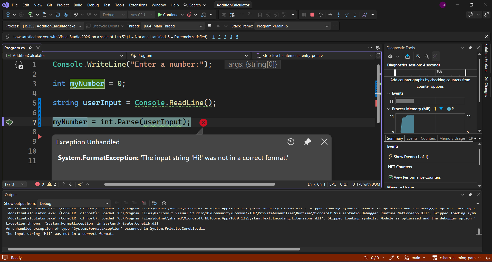
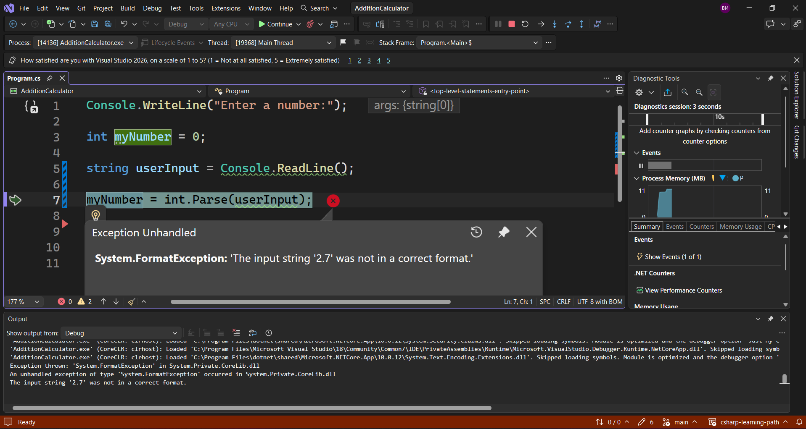
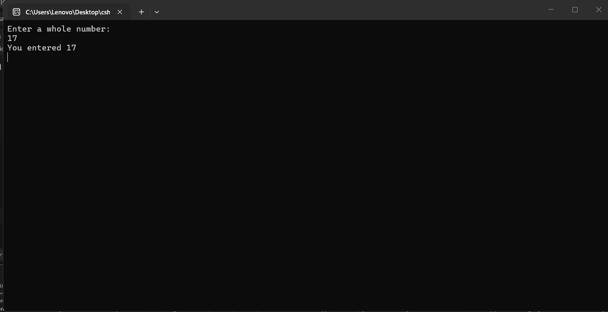

---
type: csharp-note
language: C#
created: 2026-09-21
tags:
  - csharp
---

# Изпозлване на int.Parse() метода за преобразуване на стринг в число

## 📌 Какво ще се прави?

Ще използваме метода int.Parse() за преобразуване на стринг в число.

## 🧠 Бележки

В тази лекция ние ще разгледаме `парсването`. Той ни позволява да преобразуваме от един вид данни в друг вид данни. Това обаче не работи с всичко наред. Дори и при него ние много лесно можем да се сблъскаме с грешки. Затова ние трябва да се убедим, че сме въвели правилния тип, за да не се срине нашата програма.
Засега всичко изглежда добре, но след известно време ще разгледаме подходи, чрез които ще отстраним всички тези грешки напълно и дори да не се сблъскване с подобни проблеми.
Как можем да преобразуваме каквото и да получаваме от метода `ReadLine()` в число?
Има нещо, което се нарича `parsing (парсване)`.
Затова ние можем да използваме `int.Parse()`.

> [!code] C# Използване на парсване чрез int.Parse()
> ```csharp
> myNumber = int.Parse(Console.ReadLine());
> ```

Трябва да запомним засега, че това е `read-only` структура. Той обаче съдържа няколко метода, които ни позволяват да правим интересни неща с числа. Това обаче трябва да работи само с числа.


Ние бихме могли да направим и следното.
> [!code] C# Зaмяна на кода с userInput
> ```csharp
> myNumber = int.Parse(userInput);
> ```

което като резултат ще е абсолютно същото.
Двата реда ще ни дадат абсолютно еднакъв резултат.
Както обаче разбрахме, това ще работи само ако въведем число. 
Нека да стартираме това с числото 7.



Виждаме, че това работи.
Нека да направим същото, но този път ние ще въведем текст.



Изведнъж виждаме, че нашата програма не работи.
Според грешката, която ни се подава тук, ние няма как да направим число от текста `Hi`. Това означава, че тук ние трябва да въведем число и важно това да е цяло число.
Ако ние въведем число с десетична запетая



ще получим същата грешка.
Затова може да сме по-точни, като кажем, че искаме да получаваме цяло число.

> [!code] C# Преобразуване на начално съобщение
> ```csharp
> Console.WriteLine("Enter a whole number:");
> ```

Нека сега да повторим това и ще въведем цяло число, например 17.



Сега ние вече знаем как да използваме парсинга, за да преобразуване входните данни, които получаваме като стринг в число.


