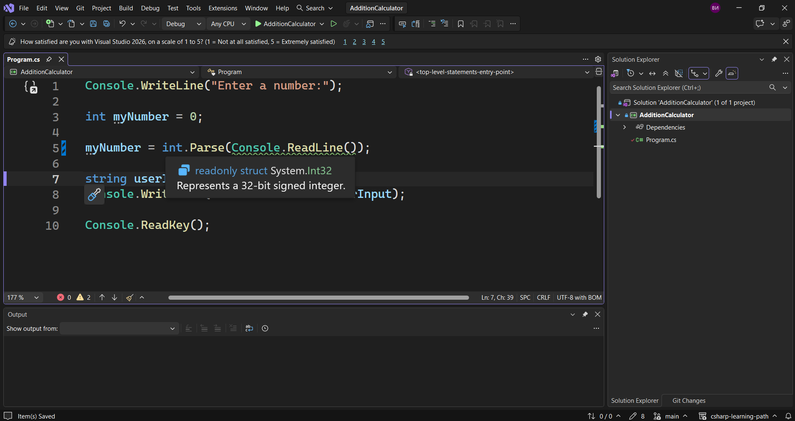

В тази лекция ние ще разгледаме `парсването`. Той ни позволява да преобразуваме от един вид данни в друг вид данни. Това обаче не работи с всичко наред. Дори и при него ние много лесно можем да се сблъскаме с грешки. Затова ние трябва да се убедим, че сме въвели правилния тип, за да не се срине нашата програма.
Засега всичко изглежда добре, но след известно време ще разгледаме подходи, чрез които ще отстраним всички тези грешки напълно и дори да не се сблъскване с подобни проблеми.
Как можем да преобразуваме каквото и да получаваме от метода `ReadLine()` в число?
Има нещо, което се нарича `parsing (парсване)`.
Затова ние можем да използваме `int.Parse()`.

> [!code] C# Използване на парсване чрез int.Parse()
> ```csharp
> myNumber = int.Parse(Console.ReadLine());
> ```

Трябва да запомним засега, че това е `read-only` структура. Той обаче съдържа няколко метода, които ни позволяват да правим интересни неща с числа. Това обаче трябва да работи само с числа.



Ние бихме могли да направим и следното.
> [!code] C# Code
> ```csharp
> int age = 25;
> string name = "Vladislav";
>
> Console.WriteLine($"Hello, {name}!");
> Console.WriteLine($"Age: {age}");
> ```