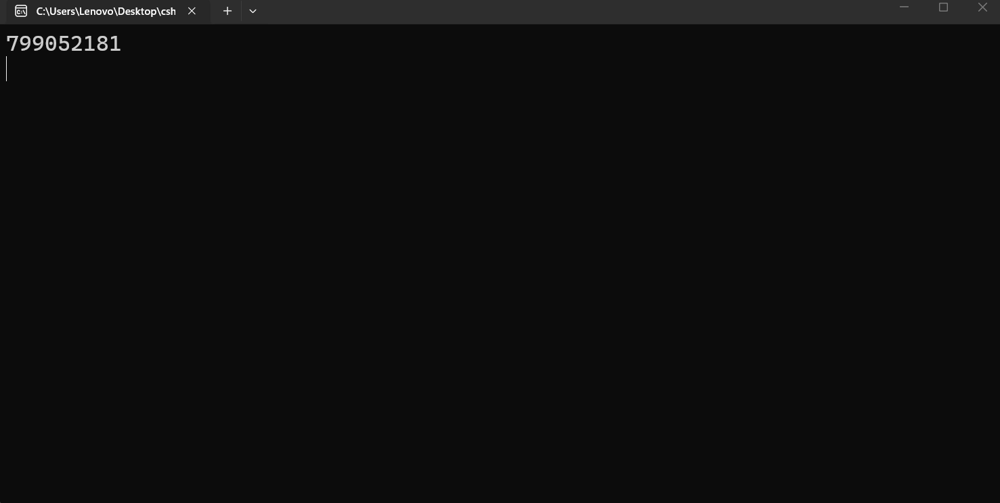

---
type: csharp-note
language: C#
created: 2026-09-21
tags:
  - csharp
---

# Експлицитно преобразуване

## 📌 Какво ще се прави?

Ще разберем експлицитното преобразуване


## 🧠 Бележки

Видяхме как работи имплицитното/неявно преобразуване. Тогава какво е `експлицитното преобразуване`?
Това ще разгледаме в тази лекция.
За целта ние ще превърнем от един тип в друг. Ще превърнем в тип данни, който може да съдържа повече информация в тип данни, който съдържа по-малко.
Ако например имаме следното

> [!code] C# Code
> ```csharp
> long myLong = 12345098312389013;
> ```

и опитаме да направим следното

> [!code] C# Code
> ```csharp
> int myInt = myLong;
> ```

вече знаем, че това няма да работи.
Ние обаче можем да го `кастнем` към `int`.

> [!code] C# Кастване
> ```csharp
> int myInt = (int) myLong;
> ```

Защо обаче грешката изведнъж изчезна? Как това голямо число може да се побере в тази `int` променлива?
Ами, не може. И ако стартираме нашето приложение



Виждаме съвършено различно число.
И така, какво е това число? изведнъж стана напълно различно число и няма нищо общо с нашето число. Това е така, понеже `myLоng` е прекалено голямо число.
Добре, ами ако числото не е толкова голямо?

> [!code] C# Code
> ```csharp
> long myLong = 123450;
> ```


По този начин виждаме, че това работи правилно.
Затова трябва да сме много внимателни с това. Наша отговорност е да се уверим, че каквото решим да `кастваме`, ще може да съдържа всички необходими данни.


