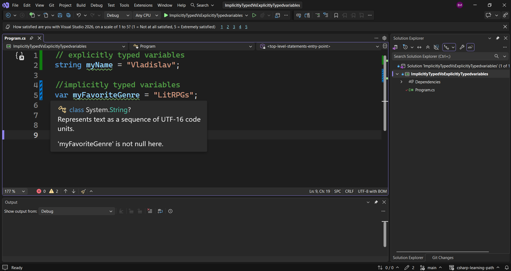

---
type: csharp-note
language: C#
created: 2026-09-21
tags:
  - csharp
---

# Имплицитно типизирани променливи vs. експлицитно типизирани променливи

## 📌 Какво ще се прави?

Ще разберем каква е разликата между имплицитно и експлицитно типизираните променливи

## 🧠 Бележки

Тук ще говорим за имплицитно типизираните променливи.
Ние разполагаме с експлицитно типизирани променливи, като например

> [!code] C# Експлицитно типизирани променливи
> ```csharp
> string myName = "Vladislav";
> ```

Сега да видим имплицитно типизираните променливи.
За да ги направим, ние използваме ключовата дума `var`.

> [!code] C# Имплицитно типизирани променливи
> ```csharp
> //implicitly typed variables
> var myFavoriteGenre = "LitRPGs";
> ```

Тук по никакъв начин не сме казали, че това е стринг. Ако обаче посочим тази променлива ще видим, че тя наистина е стринг.



Откъде тази променлива знае, че трябва да е от тип стринг? Това е така, защото се  имплицира на база типа данни, който е зададен. Тук ние сме присвоили стринг на променливата, наречен `LitRPGs`.
Ако искаме да направим същото за число

> [!code] C# Имплицитно типизирана int променлива
> ```csharp
> var myFavoriteNumber = 7;
> ```

Сега това не е стринг, а е цяло число.


