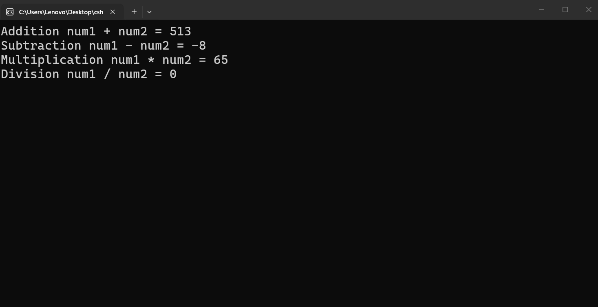
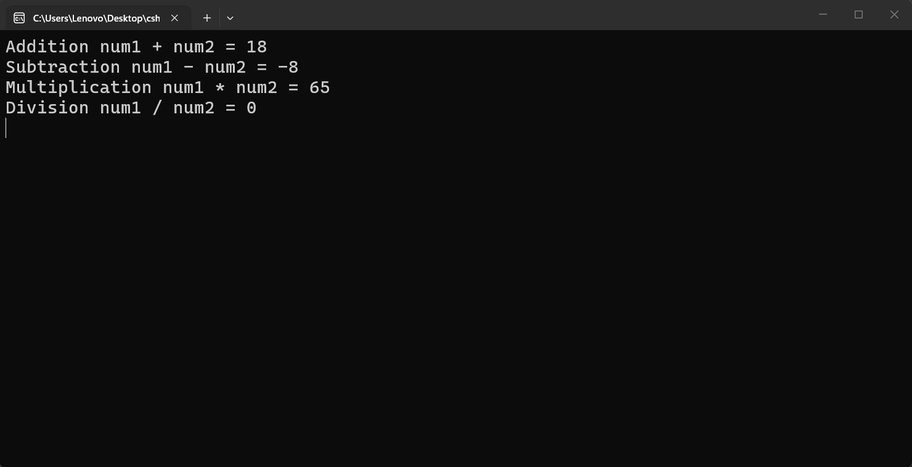

---
type: csharp-note
language: C#
created: 2026-09-21
tags:
  - csharp
---

# Оператори, ред на оценяване и базова математика

## 📌 Какво ще се прави?

Ще разгледаме още оператори, ще видим реда на оценяване на израз и ще разгледаме някои базови математически оператори

## 🧠 Бележки

Редът на оценяване е концепция ще ни бъде доста полезна за в бъдеще. Нека обаче да разгледаме изчисленията като цяло.
Ние вече видяхме как да използваме оператора + .
Знаем, че това ни позволява да съберем две стойности заедно, както направихме в нашия калкулатор по-рано.
Когато обаче искаме да направим изваждане, ние трябва да вземем предвид реда на оценяване в този случай.

> [!code] C# Ред на оценяване
> ```csharp
> int num1 = 5;
> int num2 = 13;
> Console.WriteLine("Addition num1 + num2 = " + num1 + num2);
> Console.WriteLine("Subtraction num1 - num2 = " + num1 - num2);
> Console.WriteLine("Multiplication num1 * num2 = " + num1 * num2);
> Console.WriteLine("Division num1 / num2 = " + num1 / num2);
> ```

Това, което се случва тук е, че редът на оценяваме започва от ляво надясно.
Тук ние имаме грешка, понеже ако започнем оценяване отляво надясно, ние имаме нещо подобно

> [!code] C# Code
> ```csharp
> // Subtraction  num1 - num2 = "5" - 13
> ```

което естествено няма как да се възприеме като нормална операция.
Затова редът на оценяване винаги е отляво надясно.
Тогава как можем да се справим с тази грешка?
Ние тук във втория ред използваме знака + само за конкатенция, но не и за изчисление. За да се справим с това, трябва да сложим скоби.

> [!code] C# Code
> ```csharp
> Console.WriteLine("Subtraction num1 - num2 = " + (num1 - num2));
> ```

Изведнъж това започва да работи. Сега като резултат ние ще получим -8.
Нека сега да видим това.



Виждаме, че не навсякъде получаваме правилните резултати, затова нека да се опитаме да ги поправим.
На първия ред ние имаме това, което се е случило на втория ред. Затова отново трябва да сложим скоби.
Нека да пусне това отново.



Сега имаме правилното изчисление.
Можем да видим, че умножението тук се е получило правилно.
По някаква причина обаче делението е странно и ни даде 0. Защо се получи 0? Това е така, понеже 5 делено на 13 е 0. нещо си, но `int` чисто и просто откъсва десетичната част.
Това бяха операторите и редът на оценяване.
