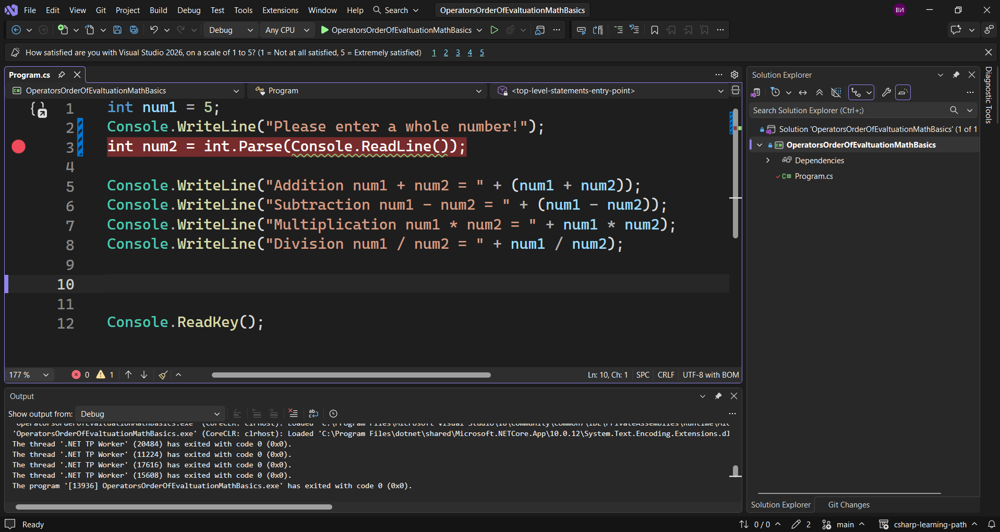
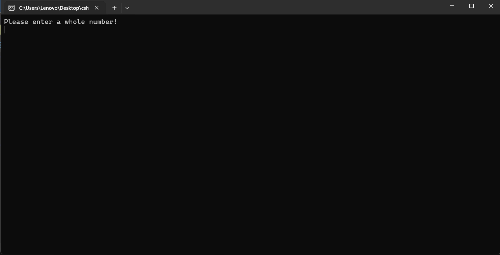
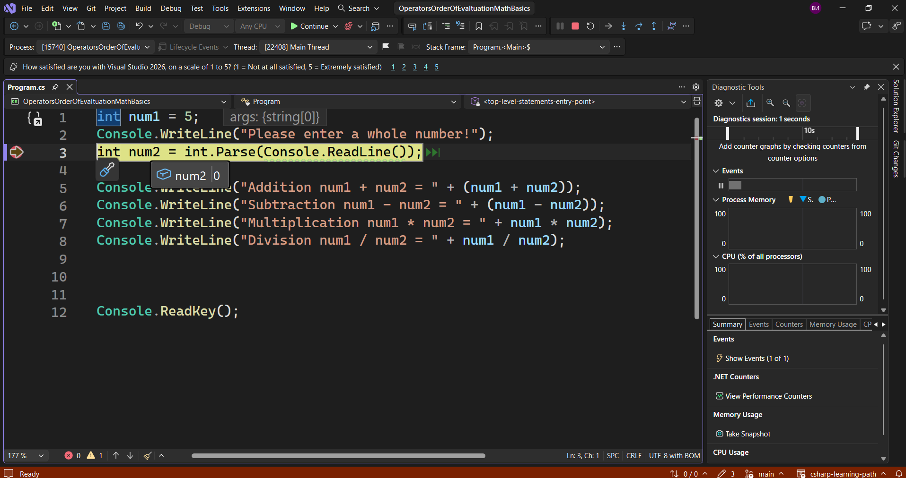
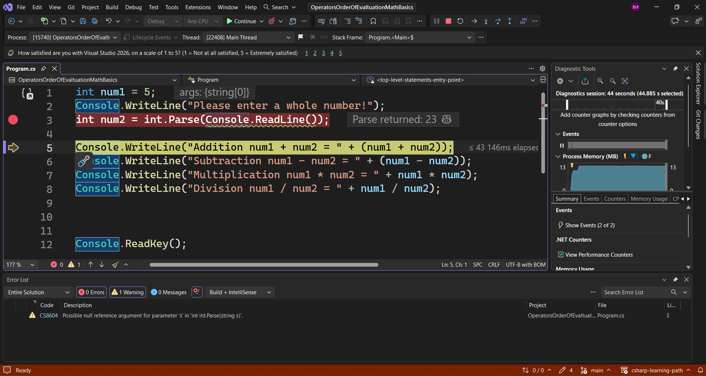
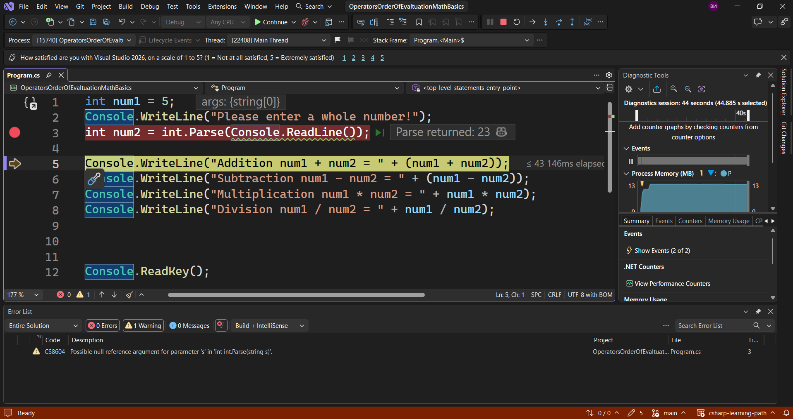
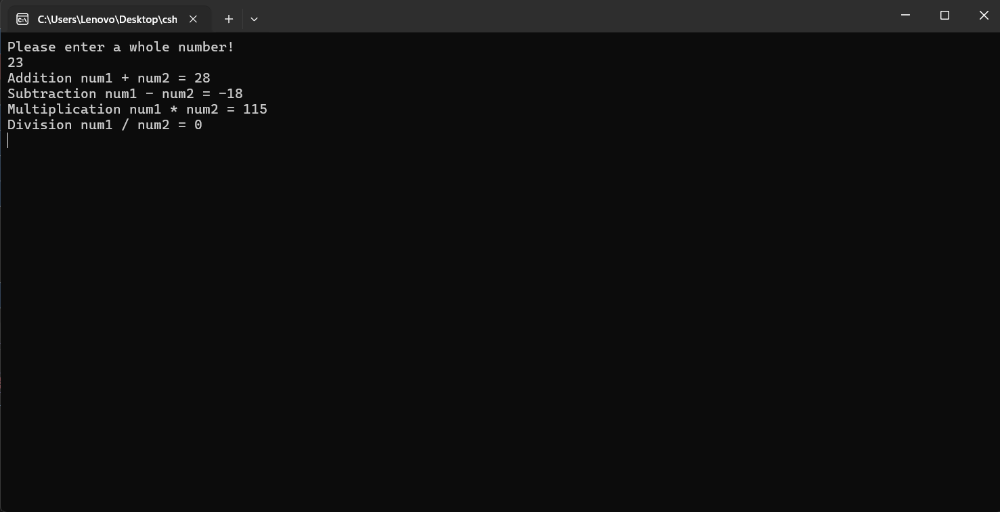
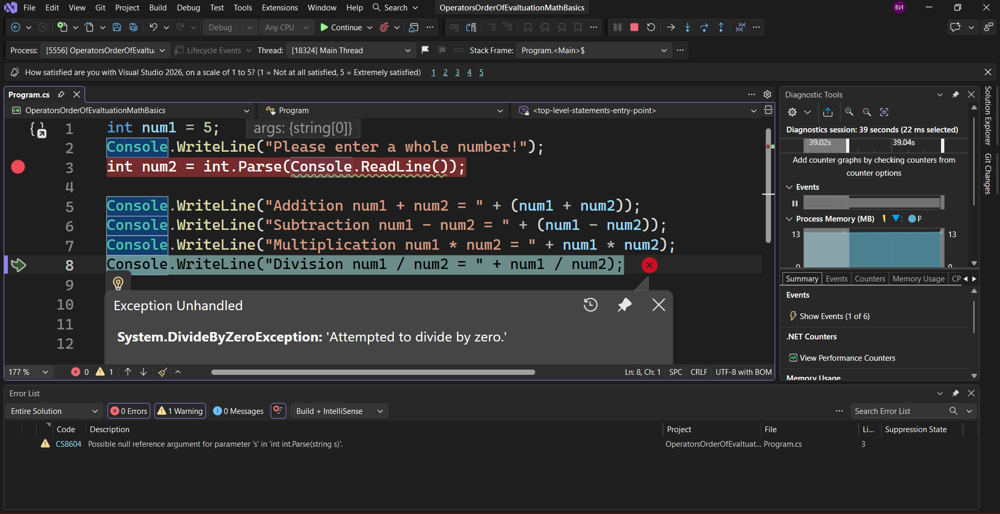

---
type: csharp-note
language: C#
created: 2026-09-21
tags:
  - csharp
---

# Дебъгване, точки на прекъсване, грешка по време на изпълнение и грешка при компилиране

## 📌 Какво ще се прави?

Ще разберем какво е дебъгване, как да дебъгваме, как да поставяме точки на прекъсване (breakpoints) и разликата между грешката по време на изпълнение и компилиране.


## 🧠 Бележки

Време е да видим дебъгването и как работят точките на прекъсване (`breakpoints`).
Съществува тази възможност с точки на прекъсване, които ни позволявам да спрем изпълнението на програмата или кода в определен момент.
Нека вместо числото 13, което имахме в последния пример, да го получаваме от потребителя.

> [!code] C# Code
> ```csharp
> int num2 = int.Parse(Console.ReadLine());
> ```

След като сме направили това, ние ще преминем през всяко едно от изчисленията, които разгледахме предната лекция.
Затова ние можем да поставим точка за прекъсване (breakpoint) да речем ето тук.



Нека сега да стартираме програмата.
Казва ни се да въведем цяло число.



Сега обаче ние не можем да въведем число, понеже софтуерът ни е замразен точно в този момент.
Можем също така да видим, че `num2` в момента е 0.



Това е така, понеже `int` по подразбиране е зададен да бъде 0.
Ако обаче сега искаме да въведем нещо, можем да кажем на програмата, че искаме да минем на следващия ред, като натиснем `[F10]`.
Сега този замръзнал ред ще се изпълни.
Виждаме, че сега отиваме на следващия ред.



Ако сега посочим отново `num2`



Можем да видим, че това е числото, което ние сме въвели в потребителския вход.
Ако натиснем бутона `Continue`, ще се изпълни останалата част от кода.



Нека да пуснем програмата отново по следния начин.
Да речем, че сриваме нашата програма и избираме да въведем 0.
Преминаваме към следващия ред.
Можем да видим, че това ни дава стойността на променливите стъпка по стъпка и е доста полезно, когато работим с много променливи.
И накрая ще имаме грешка, понеже се опитваме да делим на 0.



Това ни казва, че ние можем да направим софтуера си по възможно най-добрия начин, но данните, които ще получим, може все пак да го сринат.
