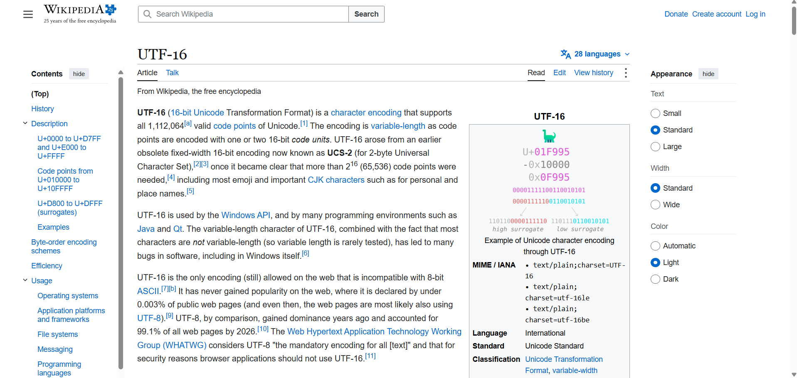

---
type: csharp-note
language: C#
created: 2026-09-21
tags:
  - csharp
---

# Тип данни char и  UTF-16 Smiley

## 📌 Какво ще се прави?

 Ще разгледаме типа данни char и ще разберем какво е UTF-16 Smiley

## 🧠 Бележки

Време е да разгледаме нов тип данни, който не сме разглеждали, но е важен и това е `char`.
`char` може да съдържа само един символ, не повече от това.

> [!code] C# Тип данни char
> ```csharp
> char myFavoriteCharacter = '0';
> ```

При задаване на `char` ние задължително трябва да имаме стойност и тази стойност се присвоява с единични кавички.
Има и други символи, които можем да добавим, като усмивки или китайски знаци например.
Принципно всички подобни знаци се намират в таблицата UTF-16. Какво обаче представлява тя?



Неяка да кажем, че по някаква причина искаме да сложим усмивка в нашия код.

> [!code] C# Усмивка в кода
> ```csharp
> char myFavoriteCharacter = '☺';
> ```

Сега ще го имаме като единичен UTF-16 символ. Да видим дали можем да го изпишем на конзолата.


