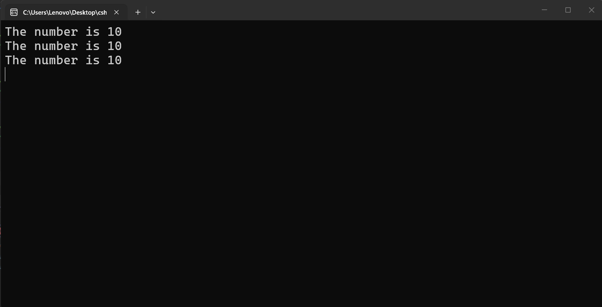
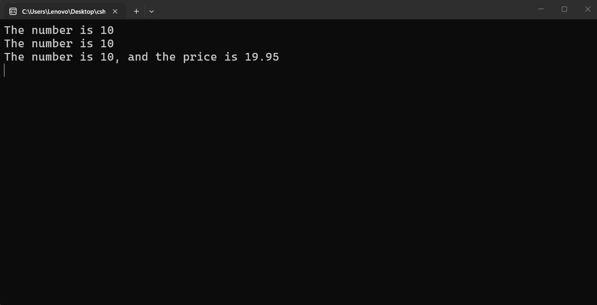
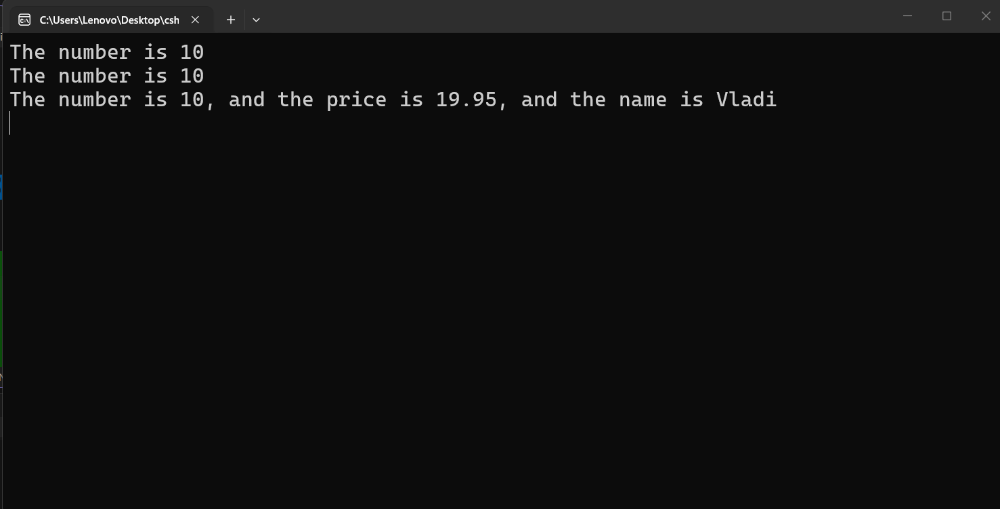

---
type: csharp-note
language: C#
created: 2026-09-21
tags:
  - csharp
---

# Още манипулации на стрингове със String Formatter

## 📌 Какво ще се прави?

Ще видим още начини за манипулиране на стрингове

## 🧠 Бележки

Нека да разгледаме още един начин за манипулиране на стрингове.
Нека за целта да имаме следния код.

> [!code] C# Манипулиране на стрингове - примерен код
> ```csharp
> int num = 10;
> double price = 19.95;
> string name = "Vladi";
> ```

Ние знаем за конкатенацията и интерполацията на стрингове.
Има и още един, който се нарича форматиране на стрингове (`string formatter`).
До известна степен това е много просто, но изисква различен начин за използване на интерполация.
Нека да видим как изглежда това.
За целта ние имаме три променливи - номер, цена и име. И сега ние искаме да кажем нещо подобно, но засега ще използваме това, което знаем до момента.

> [!code] C# Интерполация и конкатенация
> ```csharp
> Console.WriteLine($"The number is {num}");
> Console.WriteLine("The number is " + num);
> ```

Сега да разгледаме форматирането на стрингове.
В началото започваме все едно е интерполация, но без знака $ в началото, а в {} поставяме индекси, след което запетая и променливата.

> [!code] C# Форматиране на стрингове
> ```csharp
> // string formatting
> Console.WriteLine("The number is {0}", num);
> ```

Нека да видим какво се случва до момента в кода.



И това са трите различни начина, по които можем да направим това.
Защо обаче ние имаме три променливи тук? Защото искаме да покажем как това работи с множество променливи.
Нека да продължим да изписваме примера ни в конзолата.

> [!code] C# Форматиране на стрингове
> ```csharp
> // string formatting
> Console.WriteLine("The number is {0}, and the price is {1}", num, price);
> ```



Защо в началото започваме от 0? Това е така, понеже в програмирането винаги се брои от 0. Сега да видим дали можем да включим и името също.

> [!code] C# Форматиране на стрингове
> ```csharp
> // string formatting
> Console.WriteLine("The number is {0}, and the price is {1}, and the name is {2}", num, price, name);
> ```




