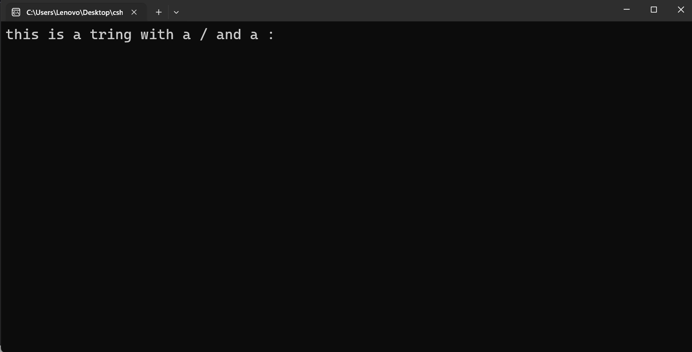

---
type: csharp-note
language: C#
created: 2026-09-23
tags:
  - csharp
---

# Как да използваме escape оператора в стрингове

## 📌 Какво ще се прави?

Ще разберем как да използваме `escape` оператора в стрингове.


## 🧠 Бележки

Ще видим как можем да използваме специални символи в низове.
Затова нека да създадем нов стринг.

> [!code] C# Code
> ```csharp
> string s1 = "this is a tring with a / and a : ";
> ```

Нека сега да го видим в конзолата.



Някои символи обаче имат специално значение при стринговете. те се наричат `escape` символи. Например " се използва за обозначаване началото и края на стринг. Ако искаме да включим двойни кавички вътре в самия стринг, ние трябва да избегнем това, като използваме обратната наклонена чертичка.
Ако опитаме да направим следното

> [!code] C# Code
> ```csharp
> string s1 = "this is a "string" with a / and a : ";
> ```

ще видим, че това ще ни даде грешка. Даже можем да и да го видим.


Естествено ние бихме могли да използваме конкатенация например тук, но вместо това ще използваме обратна наклонена черта - оператора `escape`.

> [!code] C# Използване на `escape` оператора
> ```csharp
> string s1 = "this is a \"string\" with a / and a : ";
> ```

Това сега ще третира кавичките като част от самия стринг, а не като част от самия код.
Нека сега да го пуснем отново.


В общи линии трябва да използваме този оператор при символи, които се използват в C# за писане на код.


