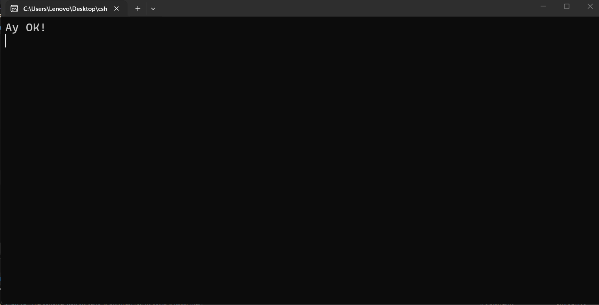
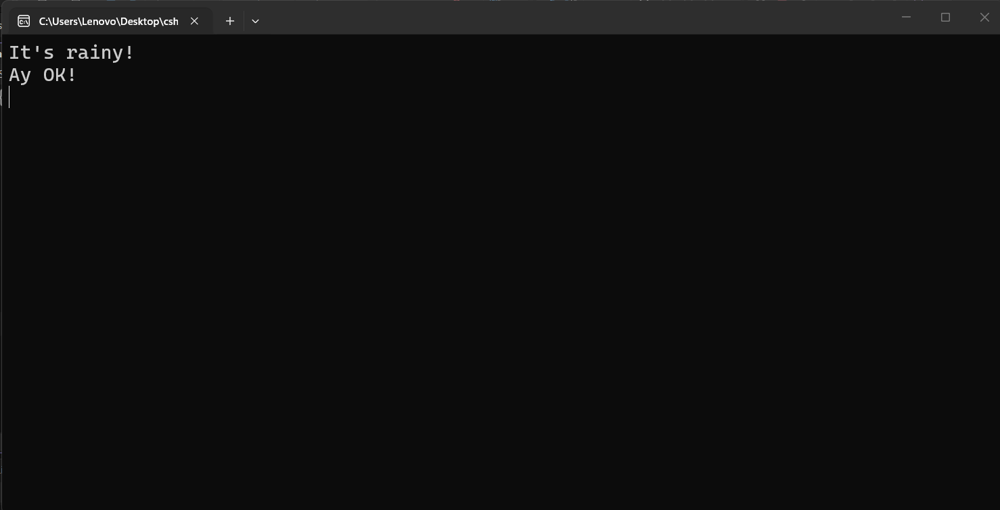

---
type: csharp-note
language: C#
created: 2026-09-23
tags:
  - csharp
---

# If изявления

## 📌 Какво ще се прави?

Ще разберем как да взимаме решения с кода ни посредством изявленията if.

## 🧠 Бележки

За да направим следващото нещо лесно, ще разгледаме `if изявленията`.
За да можем да обясним логическите оператори, първо трябва да разгледаме `if` изявленията.
Ние започваме да създаваме `if` изявление, като използваме ключовата дума `if`.

> [!code] C# Създаване на if условие
> ```csharp
> if ()
> {
> 
> }
> ```

По същество казваме, че ако това, което се намира в скобите е вярно, тогава кодът ни ще се изпълни, който ще се намира вътре в къдравите скоби. Всичко, което ще се намира там ще се изпълни, ако условието е вярно.
Ще използваме конзолата и ще напишем, че е дъждовно.

> [!code] C# Създаване на if условие
> ```csharp
> if (isRainy)
> {
> 	Console.WriteLine("It's rainy!");
> }
> ```

Нека да стартираме този код.


Можем да видим, че конзолата ни е празна.
Защо нищо не се показва? Понеже ние казахме, че каквото и да се намира в скобите на `if` условието, трябва да е вярно.
Ако сега направим следното

> [!code] C# Code
> ```csharp
>if (isRainy)
>{
> 	 Console.WriteLine("It's rainy!");
> }
> 
> Console.WriteLine("Аy OK!");
> ```

Ако сега стартираме това



`Ay OK!` се показва в конзолата, но `It's rainy` не се изпълнява. И причината за това е, че isRainy е `false`. 
Да кажем обаче, че изведнъж започва да вали.

> [!code] C# Промяна на булева стойност
> ```csharp
> bool isRainy = true;
> ```

След това нека да стартираме кода отново.



Този път `It's rainy!` се появява.
Това ни показва колко полезни може да са булевите стойности.
