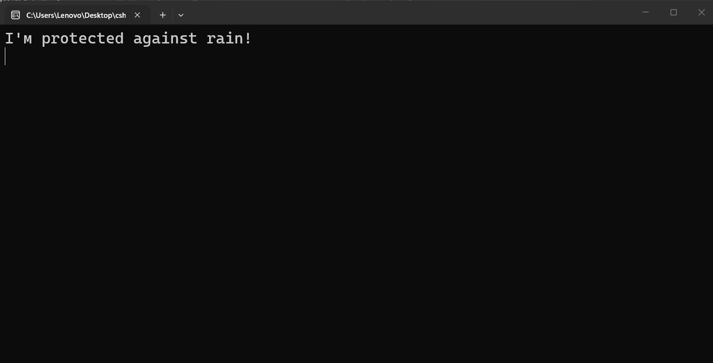
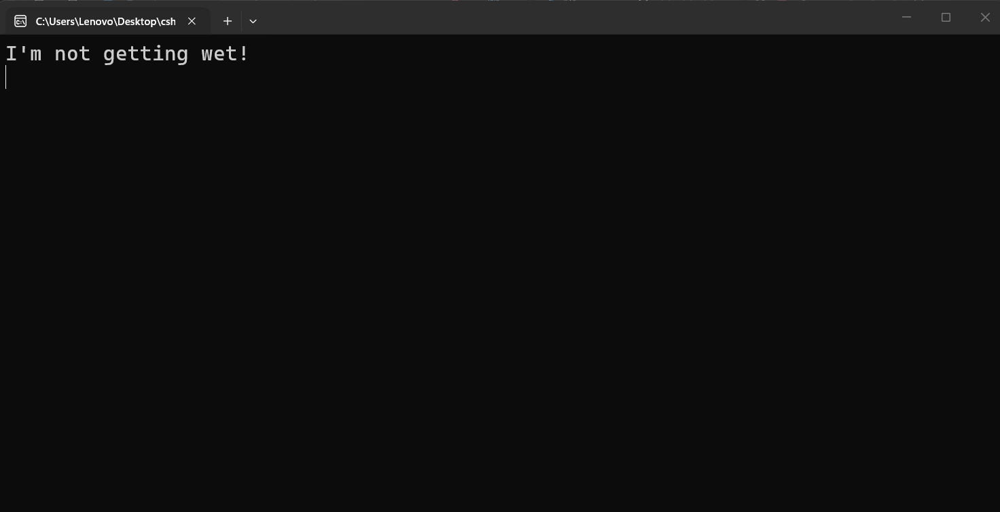
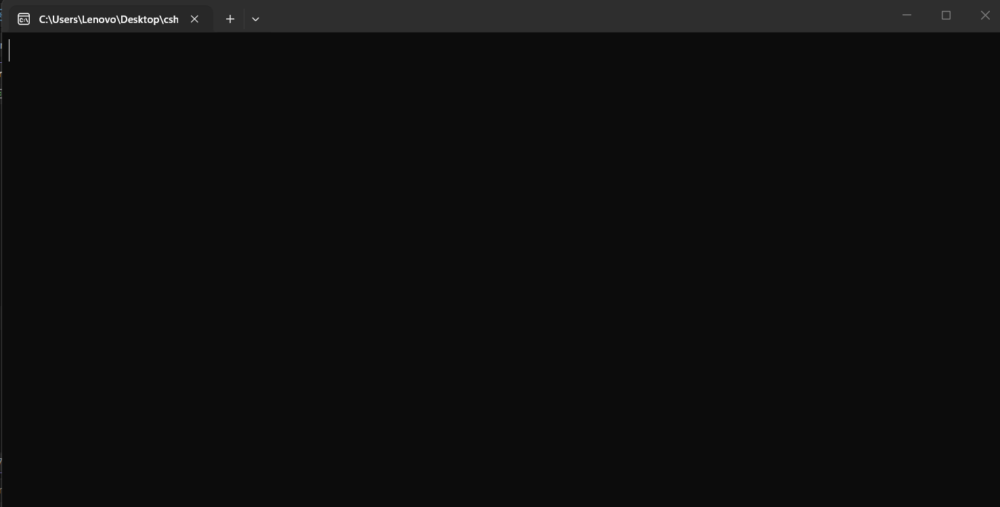
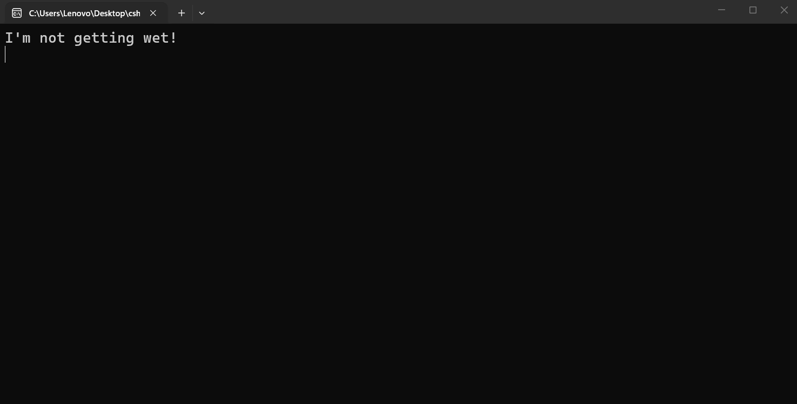

---
type: csharp-note
language: C#
created: 2026-09-23
tags:
  - csharp
---

# Оператори OR и NOT

## 📌 Какво ще се прави?

Ще разгледаме логическите оператори заедно с if

## 🧠 Бележки

Как можем да използваме логическите оператори?
Да кажем, че е дъждовно, но си имаме чадър. Тогава просто ще кажем, че сме защитени от дъжда.
В момента обаче ние не сме защитени и следователно можем да поставим `AND ( И )` оператора по следния начин и да кажем, че имаме чадър.
> [!code] C# Използване на оператор AND
> ```csharp
> if(isRainy && hasUmbrella)
> {
> 	Console.WriteLine("I'м protected against rain!");
> }
> ```

В случай че вали и че имаме чадър, ние ще сме защитени от дъжда. Затова нека да стартираме този код.



И това е използването на `И` оператора.
Сега обаче нека да използваме оператора `OR ( ИЛИ )`.
ще сменим текста в конзолата на `Няма да се намокря`.
Кога обаче няма да се намокрим? Ако имаме чадър или ако не вали.
Затова в кода ще кажем, че на този етап не вали с оператора `! ( НЕ ) .`

> [!code] C# Използване на оператор OR и NOT
> ```csharp
> if(!isRainy || hasUmbrella)
> {
> 	Console.WriteLine("I'm not getting wet!");
> }
> ```

Затова ние добавяме този ! оператор. Като го използваме, той променя първоначалното състояние на булевата променлива.



`isRainy` тук няма никакво значение дали е `true` или `false`, защото `hasUmbrella` е `true`и затова и цялото твърдение в скобите ще бъде `true` и в двата случая.
Нека обаче сега да направим следното.

> [!code] C# Code
> ```csharp
> bool hasUmbrella = false;
> ```



Сега в конзолата не получаваме нищо, понеже и двете условия са `false`.
Сега да предположим, че не вали.

> [!code] C# Code
> ```csharp
> bool isRainy = false;
> ```

Да видим сега.



Сега виждаме, че отново няма да се намокрим.
Защо обаче не се мокрим, въпреки че нямаме чадър? Защото нямаме чадър и сме казали, че не вали. И въпреки че сме казали, че `isRainy = false;`, `!` ще обърне условието и то ще стане `true`, което ще доведе до изпълнение на нашия код.


