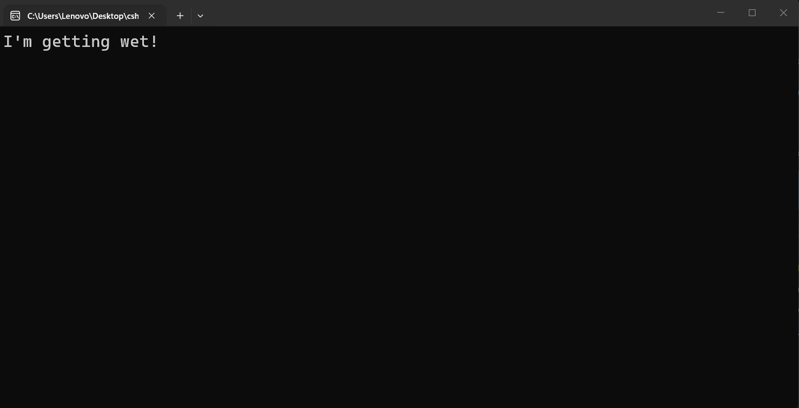

---
type: csharp-note
language: C#
created: 2026-09-23
tags:
  - csharp
---

# AND оператор

## 📌 Какво ще се прави?

Ще поговорим повече за И оператора и ще го видим в пример.

## 🧠 Бележки

Сега ще разгледаме И оператора.
Нека да напише какви са вариантите пред този оператор.
Ако и двете страни на условието са верни, то тогава ние ще получим `true`. Дори ако само едната страна обаче е `false`, тогава ще получим `false`.
И така, тогава как бихме модифицирали нашето условие, за да се намокрим в този случай?

> [!code] C# И оператор
> ```csharp
> if (isRainy && !hasUmbrella)
> {
>    Console.WriteLine("I'm getting wet!");
>  }
> ```

За целта трябва да вали и да нямаме чадър, както правим в този случай. Нека да проверим.



Ще разгледаме повече примери, понеже идеята за чадъри и дъжд се изчерпва.


