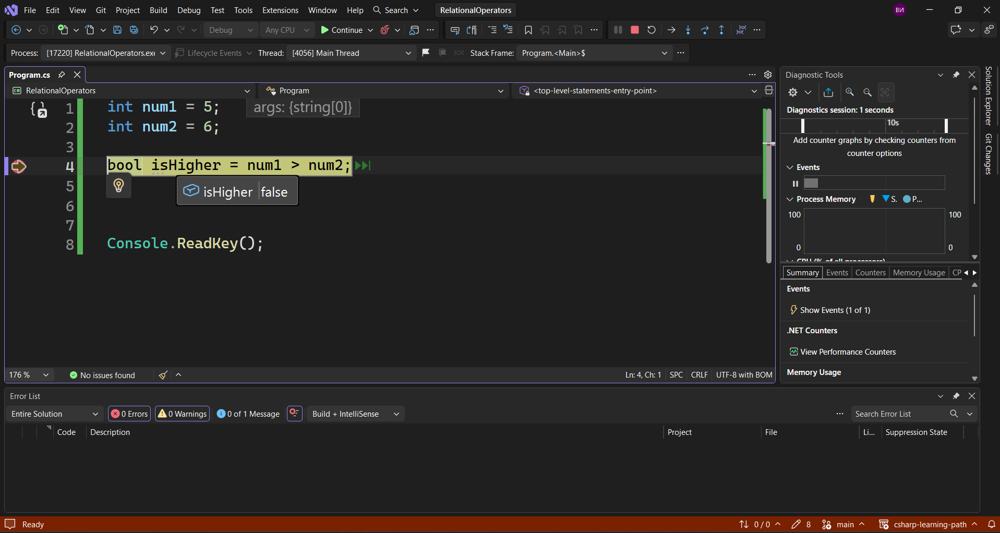
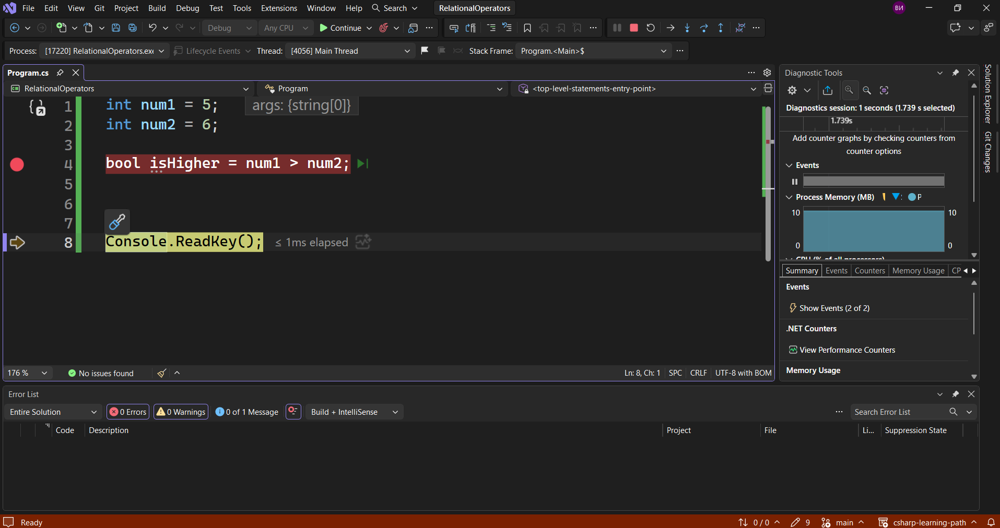
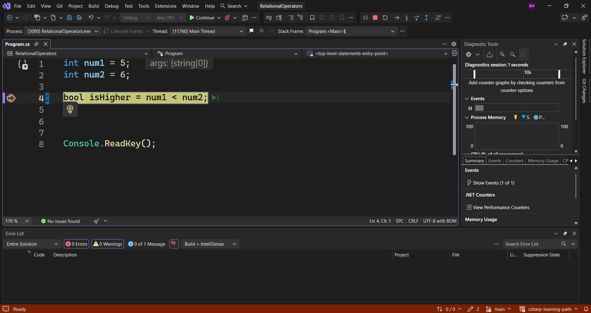
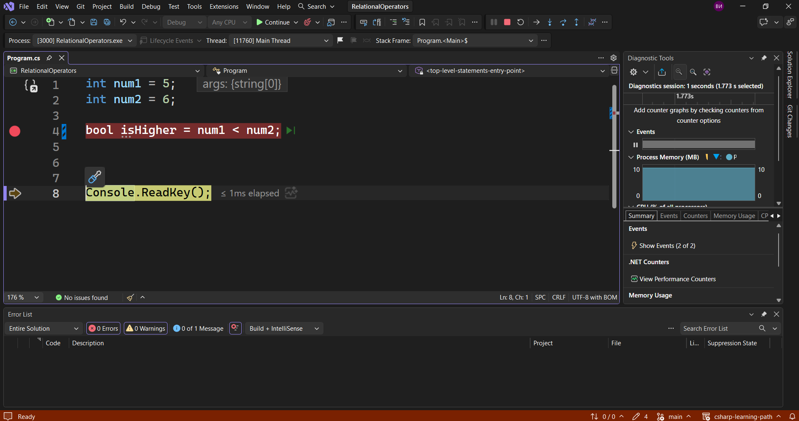
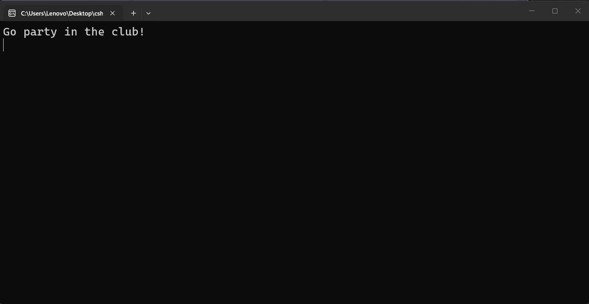
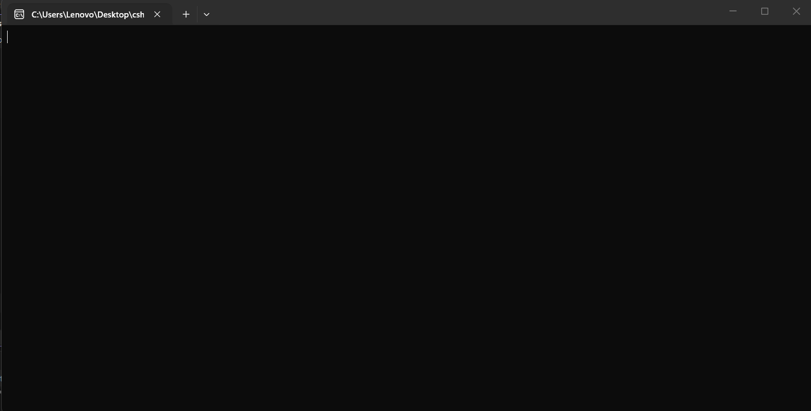
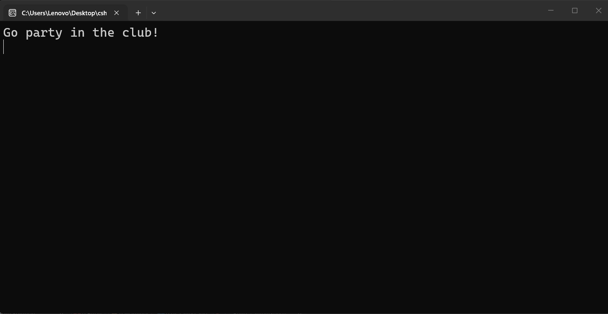

---
type: csharp-note
language: C#
created: 2026-09-24
tags:
  - csharp
---

# Условни оператори

## 📌 Какво ще се прави?

Ще разгледаме релационните оператори.

## 🧠 Бележки

Нека да видим какво представляват релационните оператори.
Идеята тук ще е да сравним две стойности и след това ще вземем решение дали е вярно или не. 
Ще имаме следния пример.

> [!code] C# Code
> ```csharp
> int num1 = 5;
> int num2 = 6;
> ```

Сега ние сравняваме тези две числа. Ще имаме булева променлива, която ще сравни двете числа.

> [!code] C# Code
> ```csharp
> bool isHigher = num1 > num2;
> ```

И така, `>` е релационен оператор.
Има и други релационни оператори.
Нека да дебъгнем нашето приложение и го стартираме.



По подразбиране `isHigher` е `false`. Това е тяхната стойност по подразбиране.
Преминаваме към следващата стъпка с `[F10]`.



Доди и след това `isHigher` е `false`.
Ако обаче сега обърнем знака.

> [!code] C# Code
> ```csharp
> bool isHigher = num1 < num2;
> ```



Както виждаме, в началото тя си е `false`. Да видим какво става после.



Сега тя е `true`, понеже 6 е по-голямо от 5.
Сега да се върнем към първоначалния ни код, където питаме дали лявата страна е по-голяма от дясната страна. И ако това е така, тогава ще имаме `true`, а в противен случай ще бъде `false`.
Как обаче можем да използваме това?
Можем да го използваме в `if` изявление, като ще създаден нова променлива.

> [!code] C# Code
> ```csharp
> int age = 35;
> if(age > 18)
> {
>   Console.WriteLine("Go party in the club!");
>  }
> ```

Нека да видим какво ще се получи.



Това е така, понеже възрастта ни е над 18 години. 
Нека обаче сега за възраст сложим примерно числото 7. Да стартираме програмата отново.



Сега не получаваме нищо. Това е така, понеже нямаме навършени 18 години.
Тук обаче може да имаме проблем, защото дори да сме на 18, ние пак няма да влезем в клуба, тъй като изискваме хората да са над 18 години. Как да се уверим, че можем да включим и 18 години? Можем да използваме знака за равенство.

> [!code] C# Използване на по-голямо или равно
> ```csharp
> if(age >= 18)
> {
>    Console.WriteLine("Go party in the club!");
>  }
> ```

И ако сега възрастта е 18, тя ще бъде включена.
Нека да видим, ако сега имаме 18 и махнем знака равно.

> [!code] C# Code
> ```csharp
> int age = 18;
> if(age > 18)
> {
>   Console.WriteLine("Go party in the club!");
>  }
> ```


Виждаме, че на конзолата нямаме нищо.
Обаче ако сега добавим знака равно.

> [!code] C# Code
> ```csharp
> int age = 18;
> if(age >= 18)
> {
>   Console.WriteLine("Go party in the club!");
>  }
> ```



Сега вече можем да празнуваме.
Вече е време да погледнем и за какво служи `else`. и ще го направим в следващата лекция.


