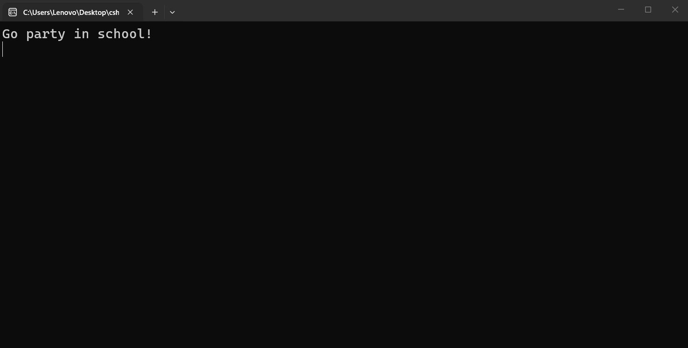

---
type: csharp-note
language: C#
created: 2026-09-24
tags:
  - csharp
---

# Else

## 📌 Какво ще се прави?

Ще разберем за какво служи else.

## 🧠 Бележки

Ще разгледаме друг много мощен инструмент, наречен `else`.
Ние имаме това `if` изявление. Нека всъщност да премахнем всички излишни неща. 
Ние знаем, че ако сме на поне 18 или повече, ще влезем в клуба. Какво обаче, ако не сме? Тогава можем да използваме блока `else`.
Ние го използваме в случая, когато нашето твърдение не е вярно.
Т.е. ако нашия `if` блок не се изпълни, ще се изпълни блока `else`.

> [!code] C# Else блок
> ```csharp
> if (age >= 18)
> {
>  Console.WriteLine("Go party in the club!");
>  } else
>  {
>  Console.WriteLine("Go party in school!");
>  }
> ```

И така, ако някой е на 18 и повече, може да влезе в клуба, но ако не е, отива в училището.
Ако сега стартираме това, ще получим същия резултат като преди.
Обаче ако решим, че сме на 13



Това до голяма степен е всичко и това до голяма степен е как работи `else` блокът.

