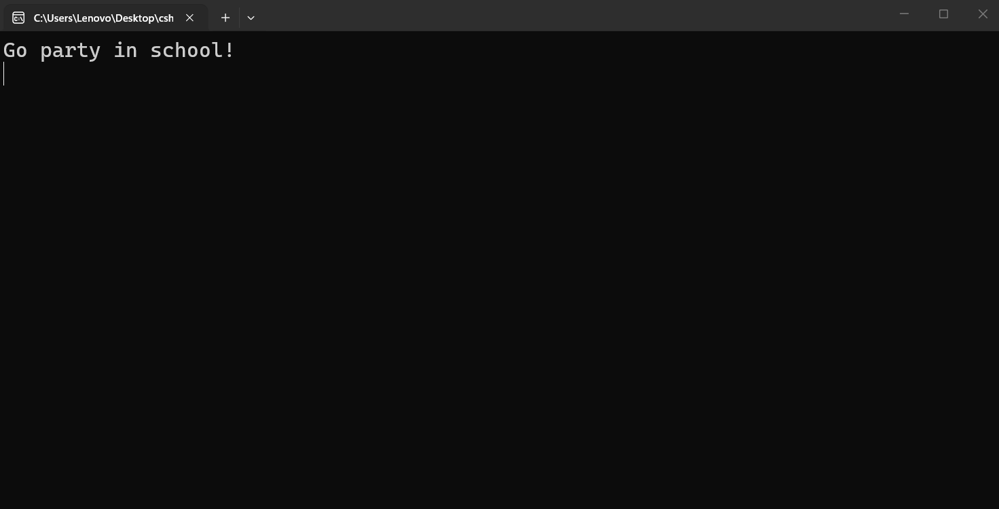
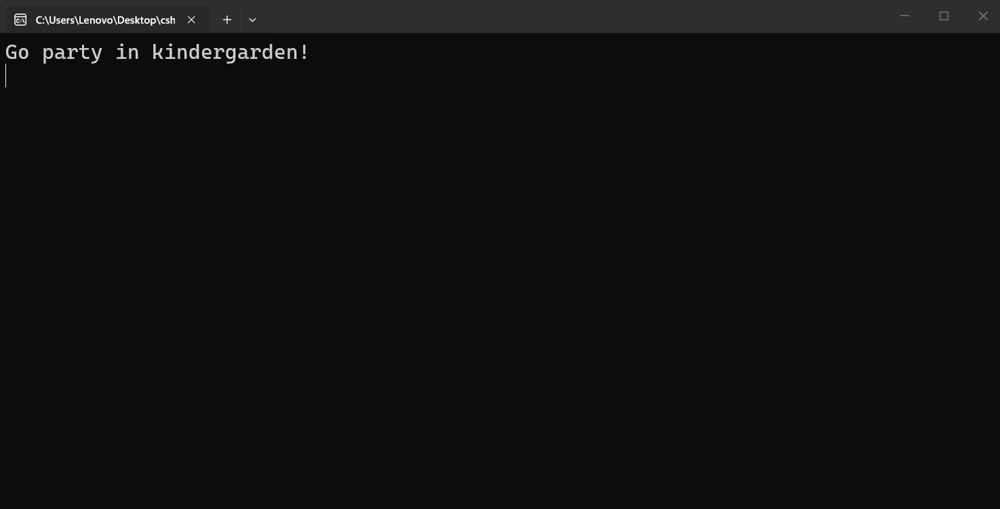
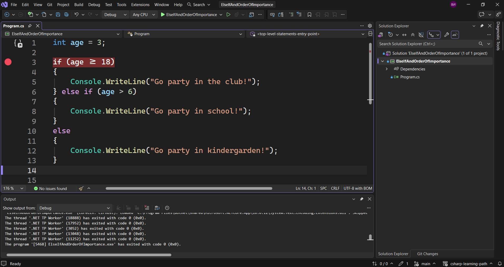
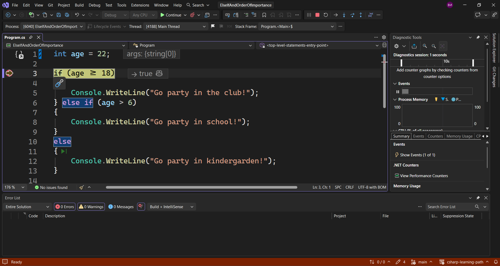
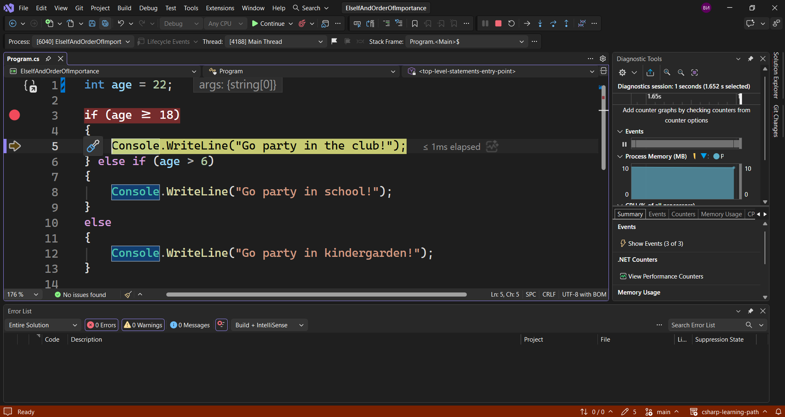
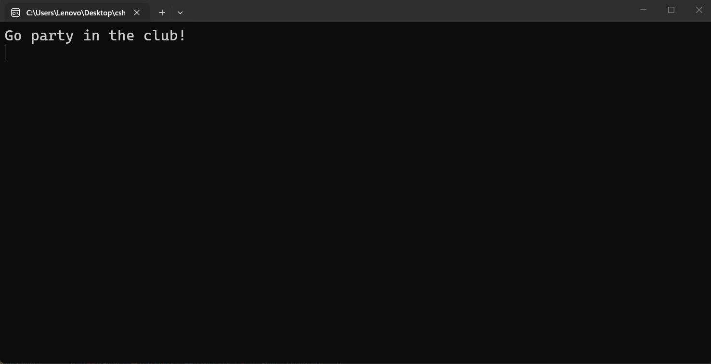
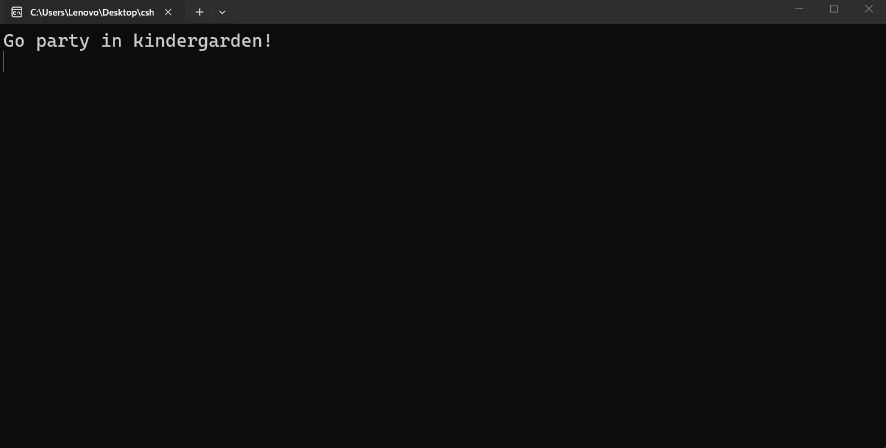

---
type: csharp-note
language: C#
created: 2026-09-24
tags:
  - csharp
---

# Else...if ключова дума и ред на важност

## 📌 Какво ще се прави?

Ще разберем кога да използваме else if

## 🧠 Бележки

Ще разгледаме `else if`, което по същество ни позволява да изпълняваме код, когато друго условие е изпълнено, ако първото не е изпълнено.
Как би изглеждало това?
Ние имаме ако възрастта е поне 18 или повече, така че нека да поставим едно ново условие точно след това

> [!code] C# Използване на else if
> ```csharp
> int age = 13;
> if (age >= 18)
> {
>  Console.WriteLine("Go party in the club!");
>  } else if (age > 6)
>  {
>  Console.WriteLine()
>  }
>  else
>  {
>  Console.WriteLine("Go party in school!");
>  }
> ```

Това ще изпълни в зависимост от ва дали неговото условие е вярно или не.
Нека да кажем, че възрастта е по-голяма от 6 години.

> [!code] C# Code
> ```csharp
> int age = 13;
> if (age >= 18)
> {
>  Console.WriteLine("Go party in the club!");
>  } else if (age > 6)
>  {
>  Console.WriteLine("Go party in school!");
>  }
>  else
>  {
>  Console.WriteLine("Go party in kindergraden!");
>  }
> ```

Сега, в зависимост от възрастта, ние ще получим определен изход. Нека да го пуснем отново.



Ние обаче имаме и друг вариант. Нека да кажем, че сме на 3 години.

> [!code] C# Code
> ```csharp
> int age = 3;
> if (age >= 18)
> {
>  Console.WriteLine("Go party in the club!");
>  } else if (age > 6)
>  {
>  Console.WriteLine("Go party in school!");
>  }
>  else
>  {
>  Console.WriteLine("Go party in kindergraden!");
>  }
> ```



Виждаме, че сега получихме различно съобщение.
Защо се получи това?
Ние имаме `if` блок, `else if` и `else` блок.
Винаги се започва отгоре надолу и се проверява всяко едно условие и когато даденото условие е вярно, то се изпълнява, а останалите не се проверяват.
Ние можем да проверим това, като сложим един `breakpoint`.



Нека обаче да тестваме с по-висока възраст, например 22.
Можем да видим, че проверява дали възрастта е по-голяма от 22, което е вярно.



Да продължим напред с `[F10]`.



Виждаме, че този код ще се изпълни, понеже за възраст ние имаме 22, а 22 е по-голямо от 18 и след това кодът ще се изпълни целия, понеже имаме правилно условие.
Обаче ако сега направим следното

> [!code] C# Code
> ```csharp
> int age = 3;
> if (age >= 18)
> {
>  Console.WriteLine("Go party in the club!");
>  } else if (age >= 6)
>  {
>  Console.WriteLine("Go party in school!");
>  }
>  else
>  {
>  Console.WriteLine("Go party in kindergraden!");
>  }
> ```

вероятно бихме си казали, че би трябвало да се изпълни и `else if` блока, понеже възрастта също е по-голяма от 6. Нека да видим дали е така.



Очевидно не е така. Само първото условие се отпечатва в конзолата. И това е така, понеже `else if` блока няма да се изпълни, понеже условието на `if` блока е вярно.
Нека обаче сега да направим това по-сложно и да добавим нова променлива.

> [!code] C# Добавяне на нова променлива
> ```csharp
> bool isWithParents = false;
> ```

Сега ще проверяваме не само за възрастта, но и за родителите по следния начин.

> [!code] C# Code
> ```csharp
> int age = 22;
> bool isWithParents = false;
> 
> if (age >= 13 && isWithParents)
> {
>  Console.WriteLine("Go party in the club!");
>  } else if (age > 18)
>  {
>  Console.WriteLine("Go party in the club!");
>  }
>  else
>  {
>  Console.WriteLine("Go party in kindergraden!");
>  }
> ```

Понеже `age` е 22, няма значение дали сме с родителите или не. Ако обаче `age` е 16, тогава те трябва да са с нас. Нека да пуснем това.



Виждаме, че трябва да ходим в детската градина.

