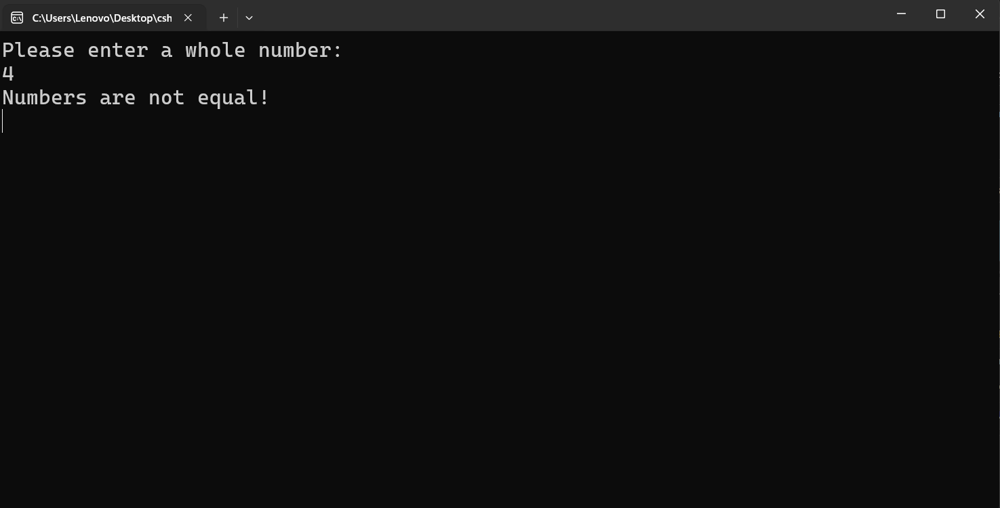

---
type: csharp-note
language: C#
created: 2026-09-24
tags:
  - csharp
---

# Оператор за равенствео и операторът а различие

## 📌 Какво ще се прави?

Ще разгледаме операторите за равенство и за различно от равно.

## 🧠 Бележки

Тук е важно да разгледаме оператора за равенство, понеже е важно да разберем как работи.
Да кажем, че имаме две числа.

> [!code] C# Задаване на две числа с еднаква стойност
> ```csharp
> int num1 = 0;
> int num2 = 0;
> ```

Сега да проверим дали тези числа са равни. Как обаче можем да проверим това?
Можем да направим следното.

> [!code] C# Проверка дали две числа са равни
> ```csharp
> bool isEqual = num1 == num2;
> ```

В случая използваме този двоен знак за равенство. Така че по този начин ще проверим дали двете числа са равни. И ако те са равни, ние ще получим `true`, а ако те не са - `false`.
Има и вариант да проверим дали не са равни и тогава използваме това.

> [!code] C# Проверка дали две числа не са равни
> ```csharp
> bool isNotEqual = num1 != num2;
> ```

Това ще провери дали стойностите на двете променливи НЕ са равни.
Да речем, че трябва да проверим дали две числа са равни.

> [!code] C# Проверка дали две числа са равни с if...else
> ```csharp
> if(num1 == int.Parse(Console.ReadLine()))
> {
>  Console.WriteLine("Numbers are equal!");
>  }
> ```

Нека сега да си добавим и `else` блок.

> [!code] C# Добавяне на else блока
> ```csharp
> if(num1 == int.Parse(Console.ReadLine()))
> {
>  Console.WriteLine("Numbers are equal!");
>  }
>  еlse {
>  Console.ReadLine("Numbers are not equal!");
>  }
> ```

Нека сега да пуснем това.



Виждаме, че изписва, че числата не са равни. Да пробваме отново.


И сега числата са равни.


