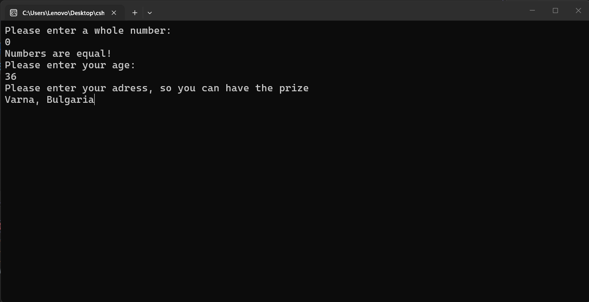

---
type: csharp-note
language: C#
created: 2026-09-24
tags:
  - csharp
---

# Вложени if твърдения

## 📌 Какво ще се прави?

Ще разберем как да използваме вложени if твърдения

## 🧠 Бележки

Съществува тази концепция за вложени `if` твърдения, което означава, че един `if` оператор се намира вътре в друг `if` оператор. Естествено ние можем да направим това и с вложен `else if`, ако пожелаем. 
Нека да видим как може да изглежда това в нашия пример.
Да кажем ,че потребителят е познал числото и сега искаме да му дадем някаква награда. За това можем да добавим нов `if`, който примерно да проверява за възрастта на потребителя.

> [!code] C# Code
> ```csharp
> if (num1 == int.Parse(Console.ReadLine()))
> {
>     Console.WriteLine("Numbers are equal!");
>     int age = 0;
>    if( age >= 18)
>     {
> 	   Console.WriteLine("Please enter your " +
> 	   "adress, so you can have the prize");
> 	}
> }
> else
> {
> 	Console.WriteLine("Numbers are not equal!");
> }
> ```

След това питаме потребителя за адреса му.

> [!code] C# Code
> ```csharp
> int age = 0;
> if( age >= 18)
> {
>  Console.WriteLine("Please enter your adress, so you can have the prize");
>   string address = Console.ReadLine();
>   }
> ```

Ние не знаем възрастта на потребителя. Затова нека да го попитаме и това.

> [!code] C# Code
> ```csharp
> int age = int.Parse(Console.ReadLine());
> if( age >= 18)
> {
>  Console.WriteLine("Please enter your adress, so you can have the prize");
>   string address = Console.ReadLine();
>   }
> ```

И така, ако възрастта им е на 18 или повече, ги молим за техния адрес.
Това е просто за да видим, че можем да имаме `if` вътре в друг `if`.
Нека да стартираме този код.



Сега адресът ще се съхрани в променливата и това е почти всичко.
Естествено сега ние бихме могли да добавим и `else` блок вътре в този вложен `if`.

> [!code] C# Code
> ```csharp
> int age = int.Parse(Console.ReadLine());
> if( age >= 18)
> {
>  Console.WriteLine("Please enter your adress, so you can have the prize");
>   string address = Console.ReadLine();
>   }
>   else {
> 	Console.ReadLine("Sorry, you can't get the prize!");
>   }
> ```

Нека да го пуснем отново.

