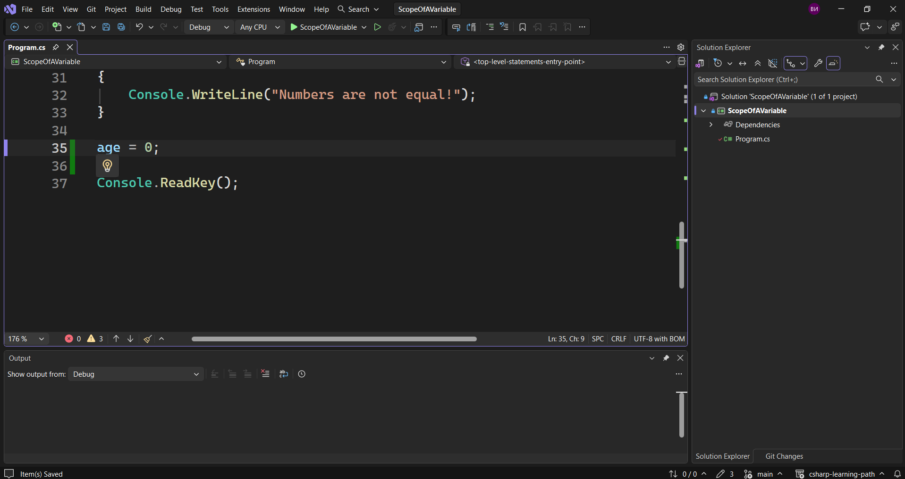
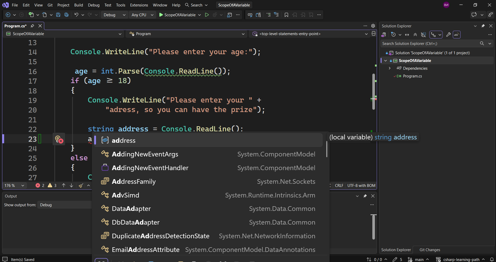
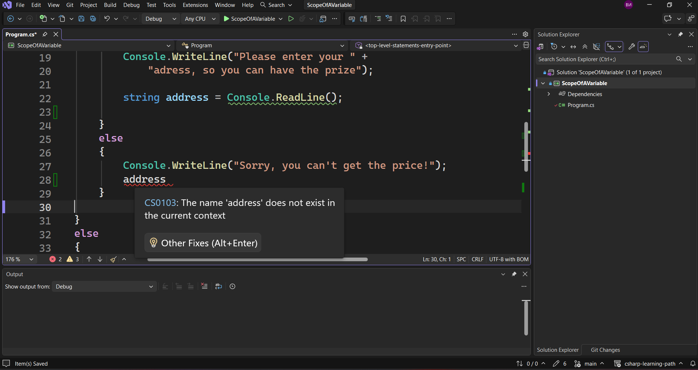
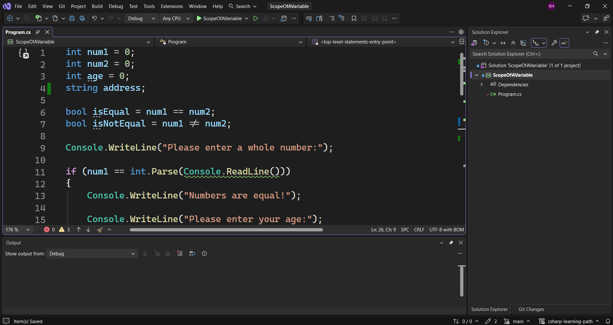

---
type: csharp-note
language: C#
created: 2026-09-24
tags:
  - csharp
---

# Разбиране на обхвата на променлива

## 📌 Какво ще се прави?

Ще разберем къде живее една променлива и как и откъде можем да я достъпваме в нашия код.

## 🧠 Бележки

В тази лекция ние ще разгледаме нещо наистина важно и това е обхватът на променливите.
Обхватът на променливата зависи от това къде тя е създадена. 
Ако се върнем към нашия код, ние имаме следното.

> [!code] C# Code
> ```csharp
> int age = int.Parse(Console.ReadLine());
> ```

който е вътре в `if` изявление. Това означава, че тази променлива няма да може да се достъпи извън този `if` блок.
Ако например ние решим да я достъпим в края на кода, ще видим, че `Visual Studio` дори не ни дава тази опция, понеже тази променлива не съществува извън обхвата си, който е къдравите скоби.
Как тогава да се уверим, че какъвто и `age` да имаме, ще може да се използва след това?
Това, което можем да направим, е да създадем променлива, която да е извън това `if` твърдение.

> [!code] C# Създаване на глобална променлива
> ```csharp
> int age = 0;
> ```

А тогава надолу в кода ние ще кажем просто `age`. По този начин ние не създаваме нова променлива.
Когато тази променлива се намира извън `ìf` изявлението, тогава нейния обхват става целия ни файл `program.cs`. И сега ние можем да достъпим променливата си буквално навсякъде.



Това означава, че всичко, което потребителят е въвел в този момент, ще се нулира и ще стане 0.
Абсолютно същото нещо се случва и с променливата `address`. Това означава, че той е достъпен само във вложената `if` декларация.



Можем да видим, че това е `локална/местна променлива`. 
Ако сега опитаме да достъпим тази променлива от долния `else` блок, не можем да го направим.



Това е така, понеже тази променлива не съществува в този обхват, където ние се опитваме да я достъпим.
Същото се случва и ако опитаме да я достъпим от друго място, например в края на кода.
За да можем да го ползваме, трябва отново да я добавим като глобална променлива.



Това е нещо, което трябваше да видим.
Обхватът е много сложно нещо, което може да доведе до грешки и проблеми, ако не се погрижим за него по подходящ начин.
Точно затова в много случаи променливите се създават в началото на кода, за да се използват навсякъде. Ако обаче знаем, че ще я използваме в определен обхват, няма да е нужно да я създаваме като глобална променлива.