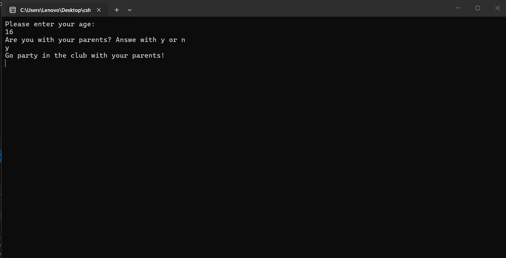
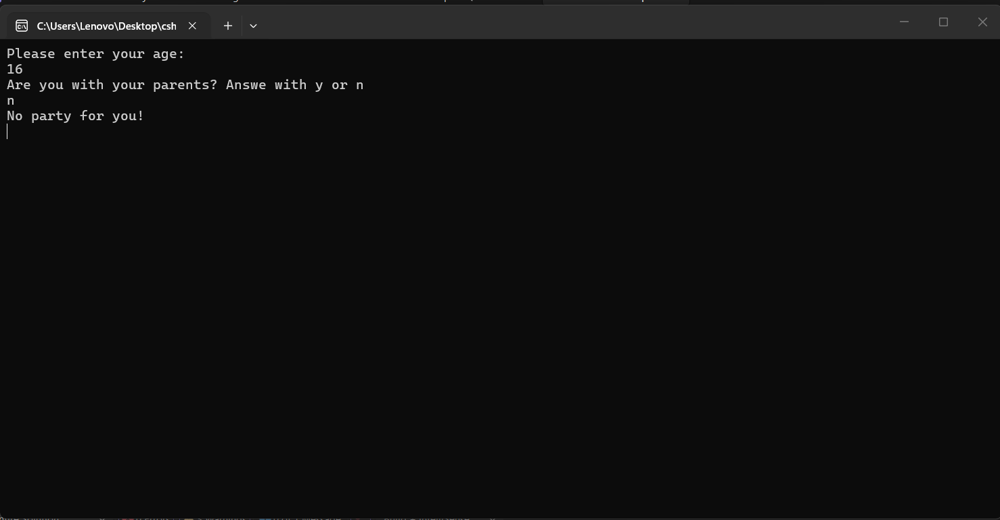

---
type: csharp-note
language: C#
created: 2026-09-24
tags:
  - csharp
---

# Предивикателство - можем ли да влезем в клуб или не

## 📌 Какво ще се прави?

Ще опитаме да модифицираме нашето приложение

## 🧠 Бележки

Нека да опитаме да модифицираме нашето приложение, където проверяваме възрастта на потребител и дали той е с родителите си или не.
Тук ще променим `age` по следния начин.

> [!code] C# Промяна на age
> ```csharp
> int age = int.Parse(Console.ReadLine());
> ```

След това ще трябва да попитаме потребителя за неговата възраст.

> [!code] C# Code
> ```csharp
> Console.WriteLine("Please enter your age:");
> ```

И така, ние проверяваме дали възрастта е по-голяма от 13 години и дали сме с родителите си. Нека обаче в началото да проверяваме дали са на 18, понеже така ще има повече смисъл.
> [!code] C# Code
> ```csharp
> if (age > 18)
> {
>    Console.WriteLine("Go party in the club!");
>  }
> ```

И сега, когато проверяваме дали са на поне 13 или повече, ще попитаме дали са с родителите си.
Сега тук бихме използваме един по-напреднал начин за това, като това ще зависи до голяма степен от възрастта на потребителя, само че ще го направим по по-познат за нас начин.

> [!code] C# Code
> ```csharp
> else if (age >= 13 && isWithParents) 
> {
> Console.WriteLine("Are you with your parents? Answe with y or n");
> string answer = Console.ReadLine();
> if (answer == "y")
>     {
>      Console.WriteLine("Go party in the club with your parents!");
>      }
>      else
>          {
>          Console.WriteLine("No party for you!");
>          }
> ```

И така, ние питаме потребителя за възрастта му, след което получаваме това в конзолата. След това имаме булева променлива, която предварително сме настроили на `false`. 
След това проверяваме дали лицето не е на 18 или повече и ако това е така, то може да влезе в клуба. Ако обаче не е, проверяваме дали е поне на 13 и питаме за родителите и искаме да се отговори с `y` или `n`.
Получаваме отговора и го съхраняваме.
После имаме нова проверка, където казваме, че ако лицето е с родителите си, може да влезе в клуба с тях. Ако обаче лицето не е с тях, не може да влезе в клуба.
И ако лицето не е на 18 или на 13, не може да влезе в клуба изобщо, но може в детската градина.
Нека да видим това.



Нека сега да видим другия случай.




